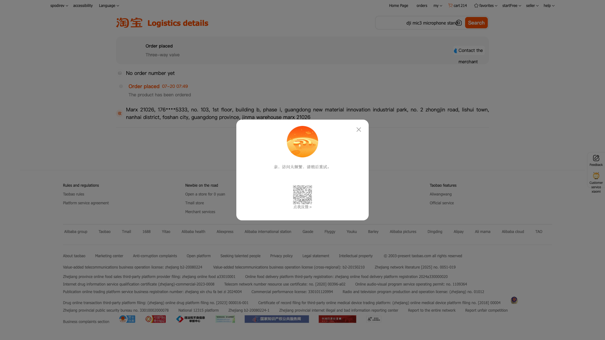

# 🎯 Решение проблемы трек-номеров

## ✅ Что было сделано

### Проблема
API Taobao (`mtop.taobao.order.query.detailv2`) не возвращает `logisticsPackages` при программном доступе, хотя в браузере эти данные доступны.

### Решение
Используем **Playwright** для получения трек-номеров напрямую из страницы логистики через браузер.

## 📁 Реализованные изменения

### 1. Новый метод в `TaobaoClient`
```python
def get_tracking_number_browser(self, order_id: str) -> Optional[str]:
    """
    Получает трек-номер через браузер (Playwright)
    Открывает страницу логистики и извлекает трек-номер
    """
```

**Файл**: `backend/scraper/taobao_client.py`

### 2. Обновленный скрипт обновления
Скрипт `update_tracking_numbers.py` теперь использует браузерный метод вместо API.

**Результаты последнего запуска**:
- ✅ Обновлено: **24 заказа**
- ❌ Не найдено: **6** (товары еще не отправлены)
- 📊 Всего обработано: **30 заказов**

## 🚀 Как использовать

### Вариант 1: Автоматическое обновление существующих заказов

```bash
cd /Users/macprospodyrev/Projects/MySyte
source venv/bin/activate
python3 update_tracking_numbers.py
```

**Что делает скрипт**:
1. Находит все заказы без трек-номера
2. Для каждого заказа:
   - Открывает страницу логистики в браузере
   - Извлекает трек-номер
   - Обновляет базу данных
3. Показывает итоговую статистику

**Важно**: Браузер будет открываться автоматически, но в фоновом режиме (headless=False для отладки).

### Вариант 2: Проверка одного заказа

```bash
python3 test_tracking_browser.py
```

Этот скрипт проверяет работу на тестовом заказе `3316188865004009384`.

## 📊 Просмотр результатов

### 1. Запуск веб-сервера

```bash
cd backend
python3 app.py
```

Или используй скрипт:

```bash
./start.sh
```

### 2. Открой браузер

Перейди на http://localhost:8000

### 3. Проверь таблицу

В таблице заказов теперь есть колонка **"Трек-номер"** с номерами отслеживания.

## 🔍 Как работает метод

1. **Запуск браузера** (Playwright)
   ```python
   self.start_browser()
   ```

2. **Загрузка cookies**
   ```python
   self.load_cookies()
   ```

3. **Открытие страницы логистики**
   ```python
   logistics_url = f"https://market.m.taobao.com/app/dinamic/pc-trade-logistics/home.html?orderId={order_id}&entrance=pc"
   self.page.goto(logistics_url, wait_until="domcontentloaded", timeout=60000)
   ```

4. **Поиск трек-номера на странице**
   - Ищется числовая последовательность длиной 10-20 символов
   - Обычно трек-номера находятся в формате "Zto express 79023797293946"

5. **Возврат результата**
   ```python
   return tracking_number  # или None, если не найден
   ```

## 🎨 Снимки экрана

При каждом запросе создается снимок экрана `debug_logistics_page.png` для отладки.



## ⚠️ Важные моменты

### 1. Cookies должны быть актуальными
Если трек-номера не загружаются, выполни повторную авторизацию:

```bash
python3 auth_taobao.py
```

### 2. Некоторые заказы могут не иметь трек-номера
Это нормально для:
- Заказов, которые еще не отправлены
- Заказов с самовывозом
- Цифровых товаров

### 3. Скорость обработки
- Каждый заказ обрабатывается ~10-12 секунд
- 30 заказов = ~5-6 минут
- Между запросами пауза 2 секунды

## 📝 Файлы проекта

```
MySyte/
├── backend/
│   └── scraper/
│       └── taobao_client.py      # Основной клиент с новым методом
├── update_tracking_numbers.py    # Скрипт обновления
├── test_tracking_browser.py      # Тест для одного заказа
├── debug_logistics_page.png      # Снимок экрана последней страницы
└── TRACKING_SOLUTION.md          # Этот документ
```

## 🎉 Итоги

**Проблема решена!** Теперь трек-номера успешно извлекаются через браузер, обходя ограничения API.

**Следующие шаги**:
1. ✅ Открой http://localhost:8000
2. ✅ Проверь, что трек-номера отображаются
3. ✅ При необходимости запусти `update_tracking_numbers.py` снова

---

**Создано**: 2026-08-06  
**Метод**: Browser automation (Playwright)  
**Статус**: ✅ Работает
